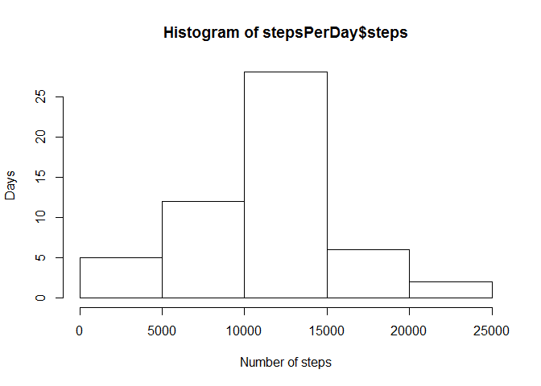
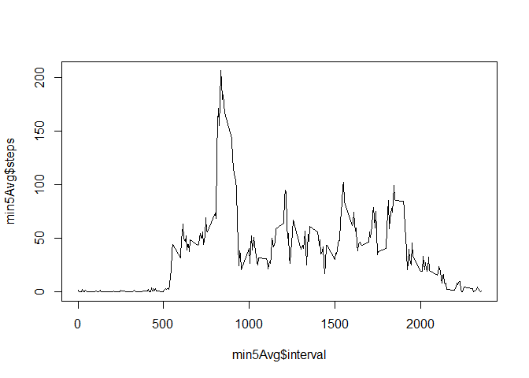
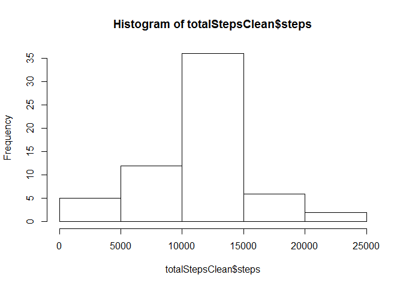
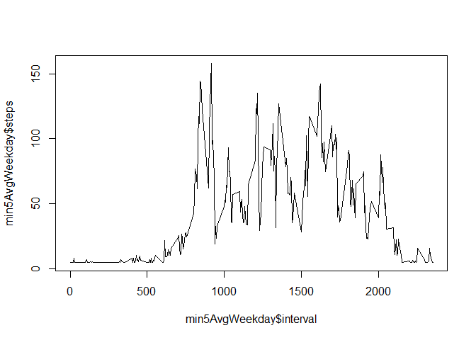
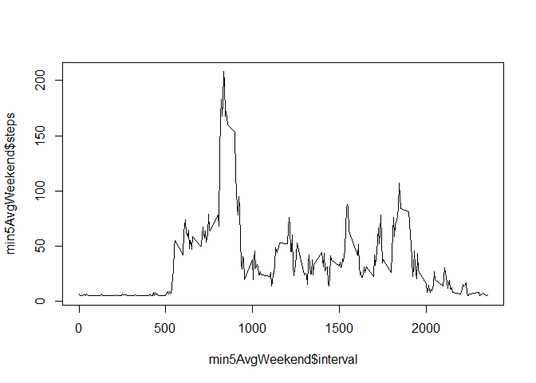

# Reproducible Research: Peer Assessment 1


## Loading and preprocessing the data

```r
unzip("activity.zip", "activity.csv")
activities <- read.csv("activity.csv")
summary(activities)
```

```
##      steps                date          interval     
##  Min.   :  0.00   2012-10-01:  288   Min.   :   0.0  
##  1st Qu.:  0.00   2012-10-02:  288   1st Qu.: 588.8  
##  Median :  0.00   2012-10-03:  288   Median :1177.5  
##  Mean   : 37.38   2012-10-04:  288   Mean   :1177.5  
##  3rd Qu.: 12.00   2012-10-05:  288   3rd Qu.:1766.2  
##  Max.   :806.00   2012-10-06:  288   Max.   :2355.0  
##  NA's   :2304     (Other)   :15840
```

## What is mean total number of steps taken per day?
Total number of steps taken per day

```r
daySteps <- sum(activities $steps, na.rm = TRUE)
stepsPerDay <- aggregate(steps~date, data = activities, FUN = sum, na.rm = TRUE)
```
Histogram of total number of steps taken each day

```r
hist(stepsPerDay $steps, xlab = "Number of steps", ylab = "Days")
```

<!-- -->

```r
stepsPerDayMedian <- median(stepsPerDay $steps)
stepsPerDayMean <- mean(stepsPerDay $steps)
```
Mean and median of the total number of steps taken per day

```r
stepsPerDayMean
```

```
## [1] 10766.19
```

```r
stepsPerDayMedian
```

```
## [1] 10765
```

## What is the average daily activity pattern?
Series plot of the 5-minute interval and the average number of steps taken

```r
min5Avg <- aggregate(steps~interval, data = activities, FUN = mean, na.rm=TRUE)
plot(x = min5Avg$interval, y = min5Avg$steps, type = "l") 
```

<!-- -->
5-minute interval with maximum number of steps

```r
maxSteps <- max(min5Avg $steps)
maxInterval <- min5Avg[which(min5Avg$steps == maxSteps),] $interval
maxInterval
```

```
## [1] 835
```

## Imputing missing values
Total missing values

```r
naCount <- sum(is.na(activities $steps))
```
Filling values

```r
clean <- activities
clean[is.na(activities $steps),] $steps <- (stepsPerDayMean/288)
totalStepsClean <- aggregate(steps~date, data=clean, FUN=sum, na.rm=TRUE)
hist(totalStepsClean $steps)
```

<!-- -->
Mean and median of filled values

```r
mean(totalStepsClean $steps)
```

```
## [1] 10766.19
```

```r
median(totalStepsClean $steps)
```

```
## [1] 10766.19
```
These values differ slightly from the first dataset. The mean is the same but the median has changed. The frequency of the interval [10.5k, 11k] has changed from 3 to 11. This is the impact of having filled NA values.

## Are there differences in activity patterns between weekdays and weekends?

```r
clean $date <- as.Date(clean $date, format = "%Y-%m-%d")
```

```
## Warning in strptime(x, format, tz = "GMT"): unable to identify current timezone 'C':
## please set environment variable 'TZ'
```

```r
clean $weekday = as.factor(ifelse(weekdays(clean$date) %in% c("Saturday", "Sunday"), "Weekday", "Weekend"))

weekday <- grep("Weekday", clean $weekday)
weekdayV <- clean[which(clean $weekday == "Weekday"),]
weekendV <- clean[which(clean $weekday == "Weekend"),]

min5AvgWeekday <- aggregate(steps~interval, data=weekdayV, FUN=mean, na.rm=TRUE)
min5AvgWeekend <- aggregate(steps~interval, data=weekendV, FUN=mean, na.rm=TRUE)

plot(x = min5AvgWeekday$interval, y = min5AvgWeekday$steps, type = "l")
```

<!-- -->

```r
plot(x = min5AvgWeekend$interval, y = min5AvgWeekend$steps, type = "l")
```

<!-- -->
